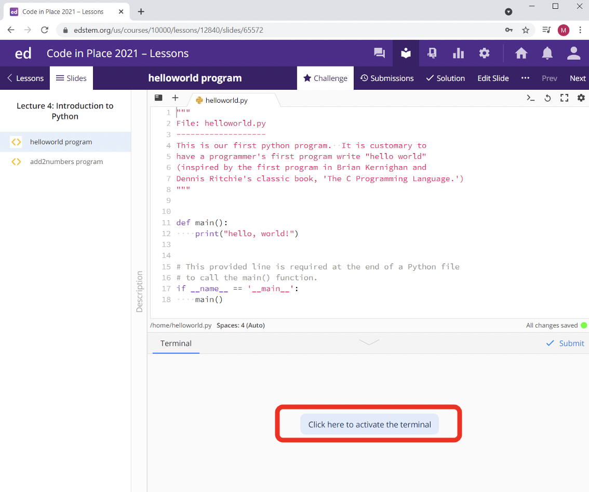
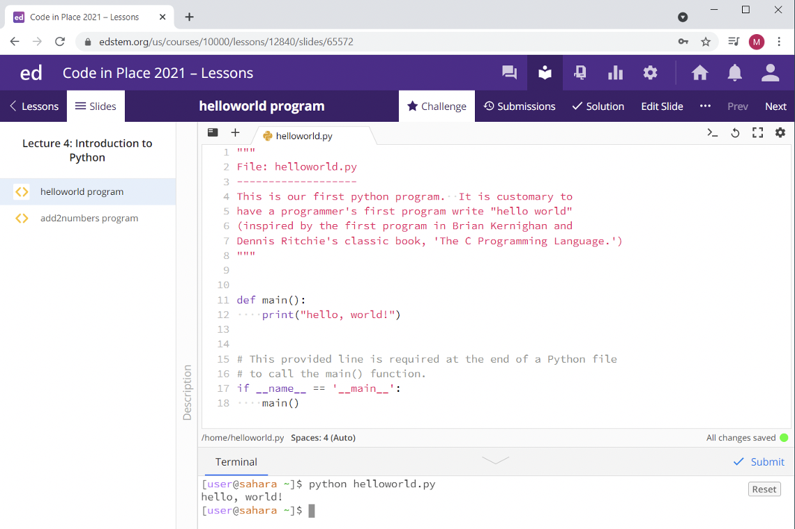

# Interpreter

You write your Python code in a text file with a name like hello.py. How does that code Run? There is program named "python", and its job is looking at and running your Python code. This type of program is called an "interpreter".

## Running code in the Ed Interpreter

***

Ed has a python interpreter. This allows it to run and execute your python code.

In Lecture 4, we wrote our first Python program: Hello World! To run our code, we need to first open the terminal on Ed. You can find the terminal underneath the code editor. To open the terminal, click the button that says Click here to activate the terminal.

Now that we've activated our terminal, we are ready to run our program! To run your program, type into the terminal:

`python filename.py`

So, if we wanted to run our Hello World program, we would type: `python helloworld.py`

This tells our interpreter: use python to run our file named `helloworld.py`

Voila! After we type `python helloworld.py` into our terminal and hit Enter, we see that the interpreter has printed out "Hello World", exactly what we wanted. Great work!
