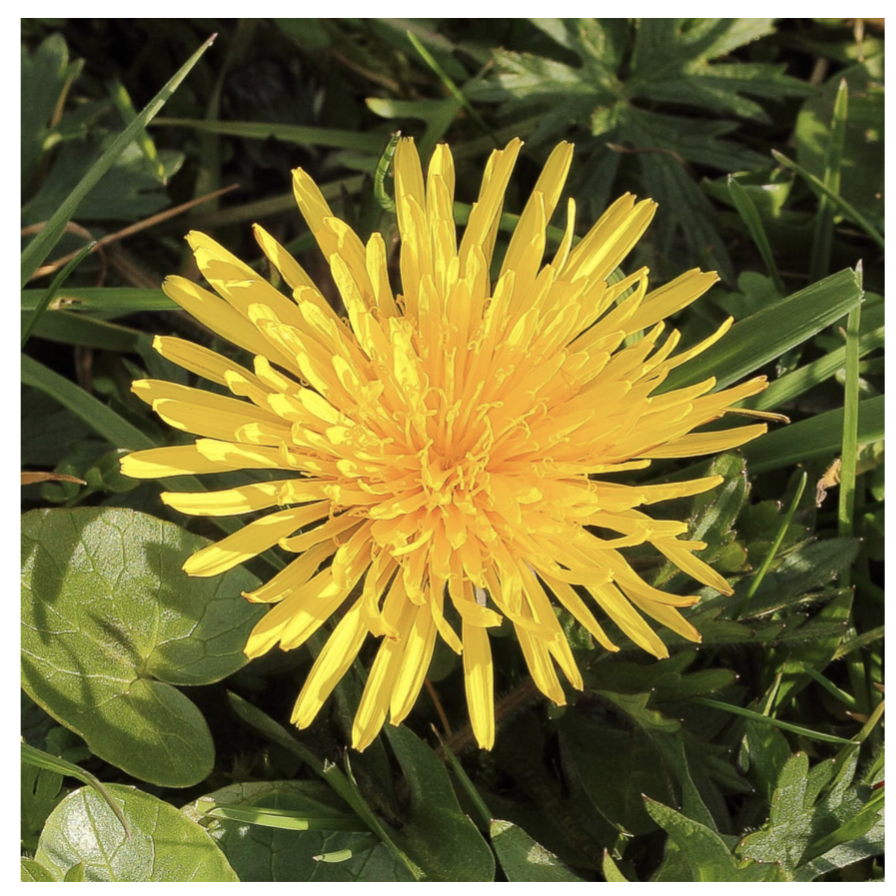
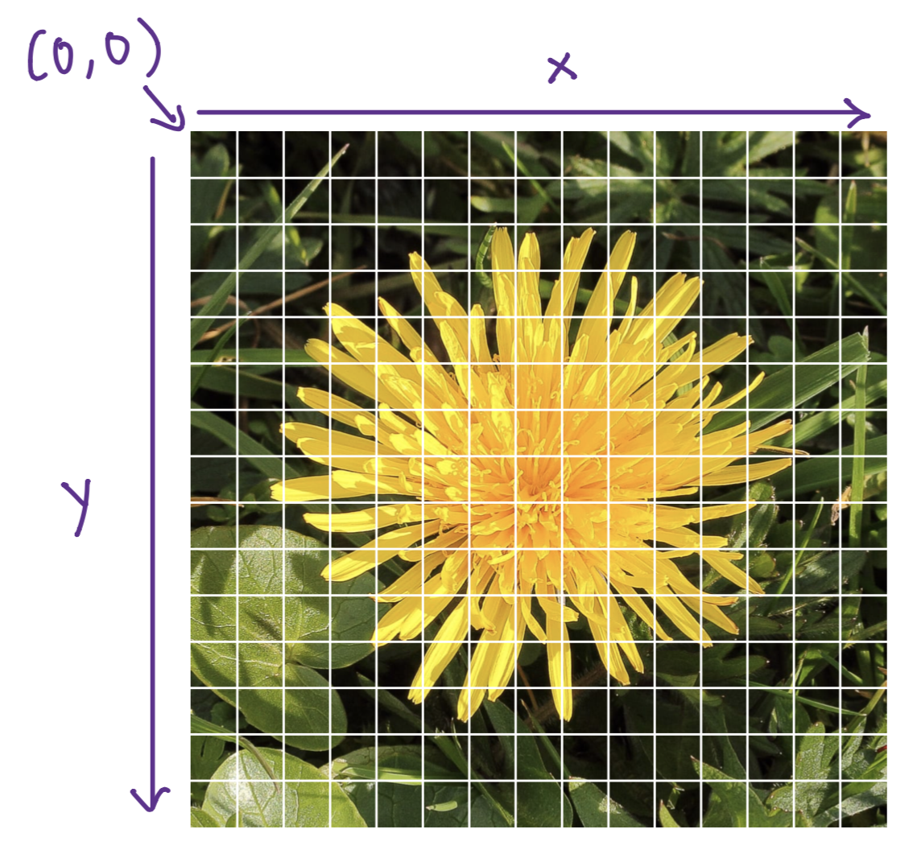
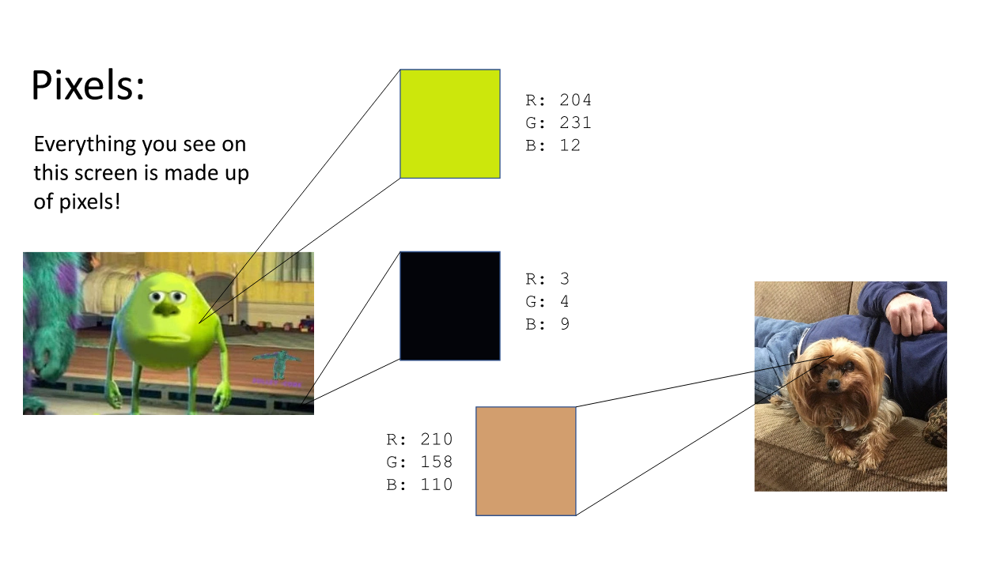
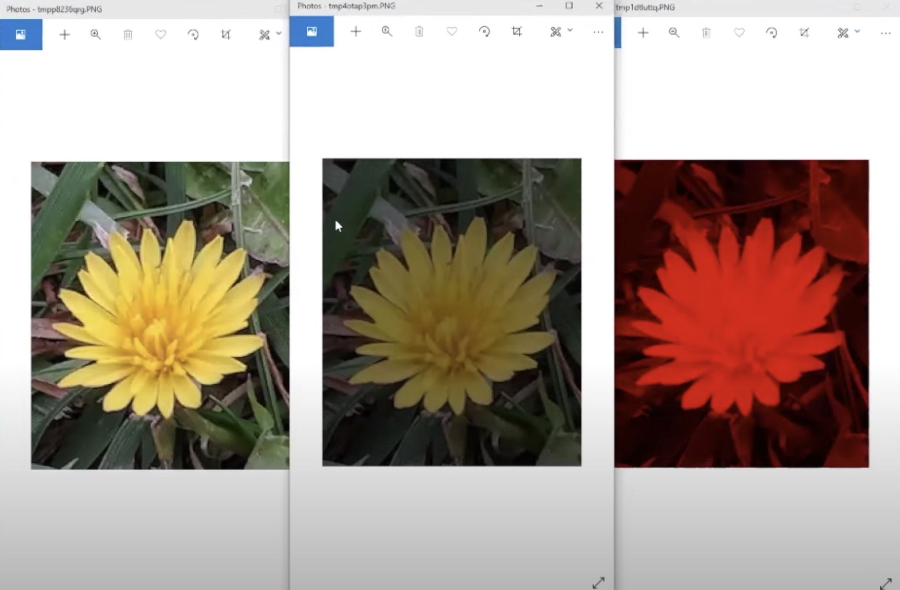
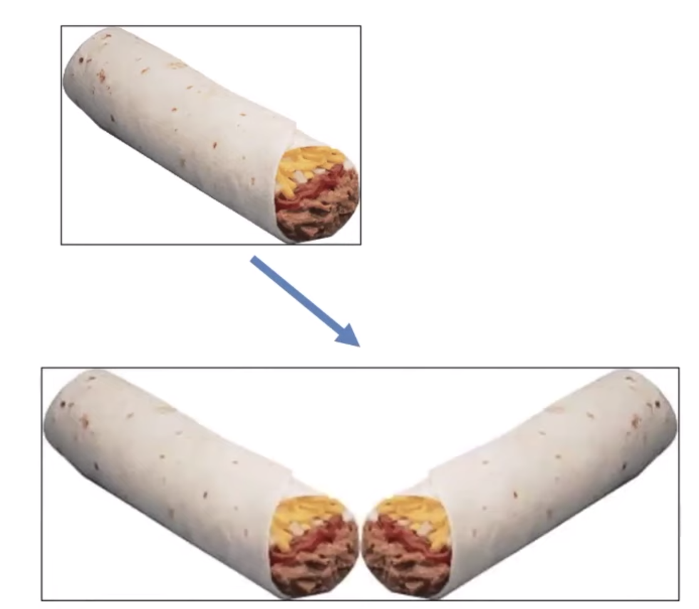
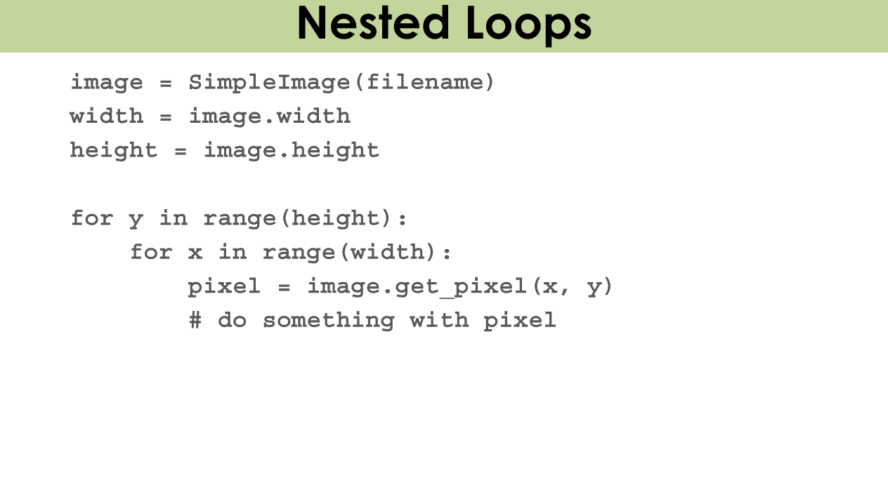
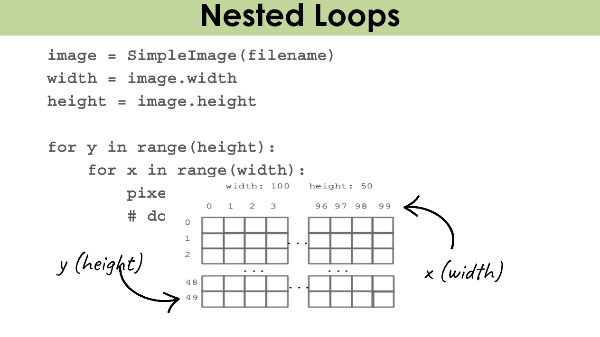

# Images

We've reached an exciting step in your Python journey — images!





## What is an image?

An image is made of square pixels.

Each pixel has single color encoded as 3 RGB values, where R = red, G = green, and B = blue. Each value represents brightness for that color (red, green, or blue). You can set RGB values to make any color!

For example, here's a close-up of the pixels that make up a scene from the Pixar movie Monsters Inc. and the pixels that make up a picture of a dog:



Each pixel has x and y coordinates in the image. The origin (0,0) is at the upper-left corner. y increases going down, x increases going right


## SimpleImage Library

In folders for assignment or lecture on images, there is a file simpleimage.py . This is the SimpleImage library, and you will use this library to work with images.

To use the SimpleImage library in your code, include at the top of your program file:

```python
from simpleimage import SimpleImage
```

This is importing the SimpleImage module, so that it is accessible in the code you write. This is similar to when you used `import random` to use the random number generator library.

Each SimpleImage object is made up of Pixel objects.

## Functions in SimpleImage Library

You can create a SimpleImage object by reading an image from file (jpg, png, gif, etc.) and storing it in a variable

```python
my_image = SimpleImage(filename)
```

To show the image on your computer:

```python
my_image.show()
```

## Accessing Pixels in an Image

We can use a new kind of loop called a "for-each" loop. Here's what it looks like:

```python
for item in collection: 
  # Do something with item 
```

Here's how to use a for-each loop with an image:

```python
image = SimpleImage("flower.jpg")
for pixel in image:
        # The code here gets repeated once for each pixel in image 
```

## Properties of Images and Pixels

Each SimpleImage image has properties you can access. For example, this is how you can access the width and height of an image:

`image.width, image.height`

Each pixel in an image also has properties:

You can get the x and y coordinates of a pixel in an image:

`pixel.x, pixel.y`

You can also get the RGB values of a pixel, which are integers between 0 and 255. Higher R, G, B values means that there is more of that color present in the pixel.

`pixel,red, pixel.green, pixel.blue`

Now, let's look at some examples.

This function, darker, returns a darker version of an image.

```python
def darker(filename): 
   """
   Reads image from file specified by filename. 
   Makes image darker by halving red, green, blue values
   Returns the darker version of image.
   """

   img = SimpleImage(filename)
   for px in image: 
      px.red = pix.red // 2
      px.green = pix.green // 2
      px.blue = pix.blue // 2
   return img
```

This function, red_channel, returns a red-shaded version of an image.

```python
def red_channel(filename): 
   """
   Reads image from file specified by filename. 
   Changes the image as follows:
   For every pixel, set green and blue values to 0, 
   yielding the red channel. 
   Return the changed image.
   """

   img = SimpleImage(filename)
   for px in image: 
      px.red = pix.red // 2
      px.green = 0
      px.blue = 0
   return img
```

Let's take these functions for a spin!

```python
def main(): 
   """
   Run your desired image manipulation functions here. 
   You should store the return value (image) and then 
   call .show() to visualize the output of your program.
   """
   
   # The name of the image file is called flower.png and it is in the 
   # images folder, so to access the file we do: 'images/flower.png'
   
   original_flower = SimpleImage('images/flower.png') 
   original_flower.show() # displays the original image 

   dark_flower = darker('images/flower.png')
   dark_flower.show()

   red_flower = red_channel('images/flower.png')
   red_flower.show()
```

Here are our resulting images. Our original image is on the left, our darkened image is in the middle, and our red-shaded image is on the left.



## Nested For vs For Each Pixel

What's the difference?

## For-each loop

```python
def darker(filename): 
   img = SimpleImage(filename)
   for px in image: 
      px.red = pix.red // 2
      px.green = pix.green // 2
      px.blue = pix.blue // 2
   return img
```

## Nested For-loop

```python
def darker(filename): 
   img = SimpleImage(filename)
   for y in range(img.height): 
      for x in range(img.width):  
         px.red = pix.red // 2
         px.green = pix.green // 2
         px.blue = pix.blue // 2
   return img
```

Nothing! Both functions above do the exact same thing: make an image darker. We only want to use nested for loops if we care about x and y .

## Mirroring an Image

For this program, we are given an image, and we want to return an image that includes the original image and its mirror reflection, like this:



How can we write a program that gives us the mirror image? We will need access to the x and y values of the pixels in the original image. In our output image, we want to set the corresponding x and y coordinates of the original image and the mirror image to be the same color.

We can use a nested for-loop to do this!





 Here's how:

```python
def mirror_image(filename): 
   """
   Reads image from file specified by filename. 
   Returns a new image that includes the original image 
   and its mirror reflection.   
   """
   
   image = SimpleImage(filename)
   width = image.width
   height = image.height 

   # Create new image to contain mirror reflection
   mirror = SimpleImage.blank(width * 2, height)

  for y in range(height): 
     for x in range(width): 
        pixel = image.get_pixel(x,y)
        mirror.set_pixel(x, y, pixel)
        mirror.set_pixel((width * 2) - (x+1), y, pixel)

  return mirror
```
