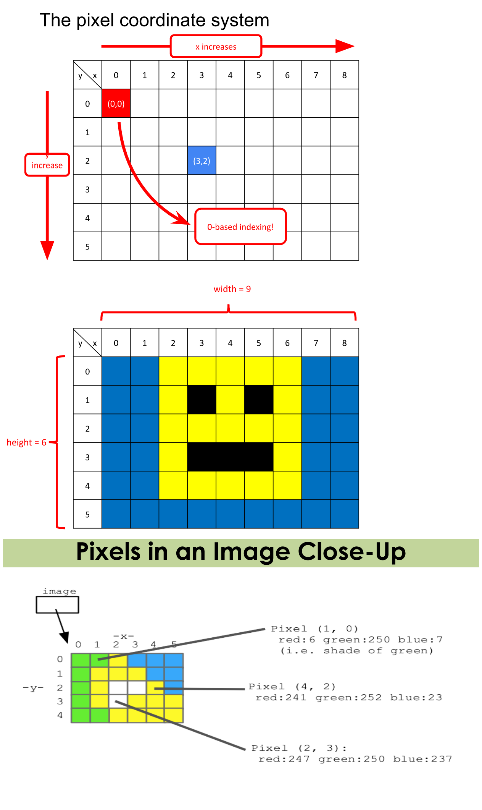

# TextGrid

TextGrid is an alternative to images for those who are visually impaired.

What is a TextGrid?

Similar to how images are made of square pixels, TextGrid objects are made of cells that contain a character value.

Here's an example of a 3x3 TextGrid that represents a patch of DNA:

ATC
CTG
TGA

Similar to images and pixels, each cell has x and y coordinates in the grid. The origin (0,0) is at the upper-left corner. y increases going down, x increases going right.



## TextGrid Library

In folders for assignment or lecture on images, there is a file textgrid.py . This is the TextGrid library, and you will use this library to work with images.

To use the TextGrid library in your code, include at the top of your program file:

```python
from textgrid import TextGrid
```

This is importing the TextGrid module, so that it is accessible in the code you write. This is similar to when you used `import random` to use the random number generator library.

### Functions in TextGrid Library

You can create a TextGrid object by reading from a text file and storing it in a variable

```python
grid = TextGrid('foo').txt
```

You can create a blank TextGrid object by specifying a width and a height

```python
grid = TextGrid.blank(400,200)
```

### Accessing Letters in a TextGrid

We can use a new kind of loop called a "for-each" loop. Here's what it looks like:

```python
for item in collection: 
  # Do something with item 
```

Here's how to use a for-each loop with a TextGrid:

```python
for letter in grid:
        # The code here gets repeated once for each letter in the grid
```

### Accessing data inside a TextGrid element

Each TextGrid image has properties you can access. For example, this is how you can access the width and height of a TextGrid:

```python
grid.width, grid.height
```

Each cell in a TextGrid also has properties:

You can get the x and y coordinates of a letter:

```python
letter.x, letter.y
```

You can also get the character value storied in a cell:

```python
letter = grid.get_letter(x, y)
```

## Advanced TextGrid functionality

### Creating a blank grid with specified height and width

This is useful for starting off with a “blank canvas” that you can populate in an algorithmically interesting way. Both of the lines of code below are valid ways of making a blank grid

```python
grid = TextGrid.blank(5, 3), grid = TextGrid.blank(width=5, height=3)
```

### Accessing a letter by its x, y coordinates

The top left of the grid corresponds to x=0, y=0. x-coordinates get larger as you move to the right, and y-coordinates get larger as you move down.

```python
myLetter = grid.get_letter(x,y)
```

### Setting the value of a certain letter in a grid by its x, y coordinates

If you have a letter (such as one returned by get_letter) and you want to place it directly into a grid, you can do so with the following function: `grid.set_letter(x, y, letter)`

If you have a character value (ex. 'A') and you want to set the letter at x, y to that value, you can do so with the following function: `grid.set_value(x, y, value)`

Note: x and y should be integers and x must be in the range 0 to width-1 (inclusive) and y must be in the range 0 to height-1 (inclusive); value should be a string that is one character long

### Range loops with TextGrid

The "for each" loop described above is the easiest way to loop over all of the cells in a grid. However, sometimes you want to write loops that access cells by their x, y coordinates. The code below demonstrates the standard nested for loop pattern to access all of the nucleotides in a genome. The outer for loop iterates over the rows (starting with the top row (y = 0) and moving on to the next row (y = 1)), and the inner for loop iterates over the columns.

```python
 def example(filename): 
  grid = TextGrid(filename) 
  for y in range(grid.height): 
    # loop over all the rows 
      for x in range(grid.width): 
      # loop over all the columns 
      character = grid.get_letter(x, y) # do something with character 
      character.show()
      return grid
```
