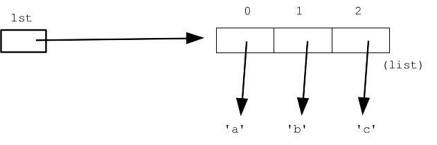

# Python Lists

## What is a list?

* A list is way to keep track of an ordered collection of items
  * Items in the list are called "elements"
  * Ordered: can refer to elements by their position
  * Collection: list can contain multiple items
* The list dynamically adjusts its size as elements are added or removed

## Creating Lists

* Lists start/end with brackets. Elements are separated by commas.

    ```python
        my_list = [1, 2, 3]
        reals = [4.7, -6.0, 0.22, 1.6]
        strs = ['lots', 'of', 'strings', 'in', 'list']
        mix = [4, 'hello', -3.2, True, 6]
        empty_list = []
    ```

* *Note: A list with one element is not the same as the element! `3` is not the same as `[3]`

## Accessing Elements of a List

Consider the following list:

```python
letters = ['a', 'b', 'c', 'd', 'e']
```

We can think of the list like a series of variables that are indexed, where the indexes start from 0.



## Basic Operations

`lst = []` - create empty list

`lst = [1, 2, 3]` - create list with data in it. As a convenience, it's allowable to have an extra comma at the end of the series of elements like this:
`[1, 2, 3,]`

`len(lst)` - access length of string

`lst[0]` - access individual elements with square brackets

`for x in lst:` - loop over contents, do not modify lst during loop

`x in lst` - boolean test if x is in lst (just like for string)

`lst.append(x)` - add x to the end of lst, increasing its length by 1. The easiest way to add to a list. Does not return anything. Changes lst in place.

```python
>>> lst = []           # Start with empty list
>>> lst.append('a')    # Append() elements
>>> lst.append('b')
>>> lst.append('c')
>>> lst
['a', 'b', 'c']
>>> len(lst)
3
>>> lst[0]
'a'
>>> lst[2]
'c'
>>> lst[3]
IndexError: list index out of range
>>> 
>>> lst
['a', 'b', 'c']
>>> lst[0] = 'apple'   # Change data at index 0
>>> 
>>> lst
['apple', 'b', 'c']
>>> 
>>> 'b' in lst         # "in" check
True
```

## List pop()

`lst.pop()` - remove the element from the end of the list and return it, decreasing the length of the list by 1. Mnemonic: the exact opposite of `append()`.

`lst.pop(index)` - alternate version with the index to remove is given, e.g. `lst.pop(0)` removes the element at index 0. Raises an error if the index is not valid.

```python
>>> lst = ['a', 'b', 'c', 'd']
>>> lst.pop()   # default = remove from end
'd'
>>> lst
['a', 'b', 'c']
>>> lst.pop(0)  # can specify index to pop
'a'
>>> lst
['b', 'c']
```

## List remove()

`lst.remove(elem)` - search the list for the first instance of elem and remove it. It's an error to `remove()` an elem not in the list - could use `in` to check first. Note that `pop()` uses index numbers, but `remove()` uses the value, e.g. 'b', to search for and remove.

```python
>>> lst = ['a', 'b', 'c', 'd']
>>> lst.remove('b')
>>> lst
['a', 'c', 'd']
>>> lst.remove('b')
ValueError: list.remove(x): x not in list
```

## List extend()

`lst.extend(lst2)` - add all the elements of lst2 on to the end of lst.

```python
>>> lst = [1, 2, 3]
>>> x = [4, 5]
>>> lst.extend(x)   # extend = add all
>>> lst
[1, 2, 3, 4, 5]
```

## Append vs. Extend

Append vs. extend example:

```python
>>> lst = [1, 2, 3]
>>> x = [4, 5]
>>> # what happens .append() vs. .extend() ?
>>>
>>> # 1. append:
>>> lst.append(x)
>>> # x is added as an *element* so lst is [1, 2, 3, [4, 5]]
>>>
>>> # 2. extend:
>>> lst.extend(x)
>>> # all elements of x are added at end, so lst is [1, 2, 3, 4, 5]
```

## List +

The `+` operation is an alternative to extend(), combining lists to make a bigger list (very analogous to `+` with strings)

```python
>>> lst = [1, 2, 3]
>>> x = [4, 5]
>>> lst + x      # put lists together
[1, 2, 3, 4, 5]
>>> lst          # original is unchanged
[1, 2, 3]
```

## List index()

`lst.index(x)` - Look for first instance of x in lst and return its index. Raises an error if x is not in there - this is rather inconvenient. Therefore check with `in` first, and only if x is in there call index(). In other words, there is nothing as simple as str.find() for lists which IMHO seems like a real omission.

```python
>>> lst = ['a', 'b', 'c']
>>> lst.index('c')
2
>>> lst.index('x')
ValueError: 'x' is not in list
```

## List min(), max()

`min(lst)`, `max(lst)` - Return the smallest or largest element in lst. Uses the same underlying < foundation as sorted(), but much faster than sorting the whole list. Raises an error if the list is empty. Note that some functions, like these and len(), are regular functions, not noun.verb. That is because these functions work on many data types, not just lists.

```python
>>> min([2, 5, 1, 6])
1
```

## List insert(), copy()

`lst.insert(index, x)` - insert the element x so it is at the given index, shifting elements towards the end of the list as needed. Use index=len(lst) to insert at the end. Append() is simpler since it just goes on the end without any shifting and you don't have to think about index numbers.

 ```python
>>> jedi = ['luke', 'obiwan']
>>> jedi.insert(1, 'mehran')
>>> jedi
['luke', 'mehran', 'obiwan']
```

More details at official Python List Docs

## Foreach loop - for elem in list

It's very easy to "foreach" loop over all the elements in a list, seeing each element once. Do not modify the list during iteration.

```python
urls = ['https://....', ...]
for url in urls:
    # use url in here
    print(url)
```

## Index loop - for i in range

The standard for/i/range loop works on lists too, using square brackets to access each element. Use this form if you want to know the index number each element during iteration.

```python
lst = [...]
for i in range(len(lst)):
    # use lst[i]
```

## Load a list with data

A common pattern to load up a list is to start with the empty list, and then in a loop of some sort, perhaps reading lines from a file, use .append() to load elements into the list.

```python
lst = []
for i in range(10):
  lst.append(i)
# lst = [0, 1, 2, 3, 4, 5, 6, 7, 8, 9]
```

## Variables passed as parameters

| Variables that act like they are copied (called immutable) | Variables that act like their URL is copied (called mutable) |
| ---------------------------------------------- | ------------------------------------------------ |
| integer, float, boolean, string                | canvas, pixel, SimpleImage, list                 |
| These types are called "immutable". You get copies of values for parameters | These types are called "mutable". You get reference (RUL) for parameters. They are changed in place when you assign |
