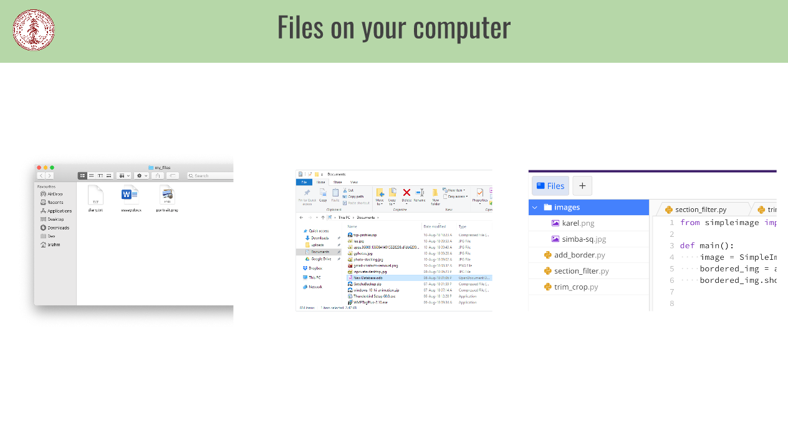
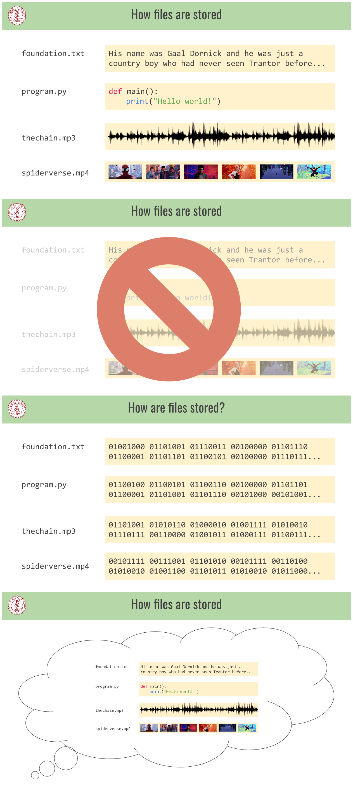
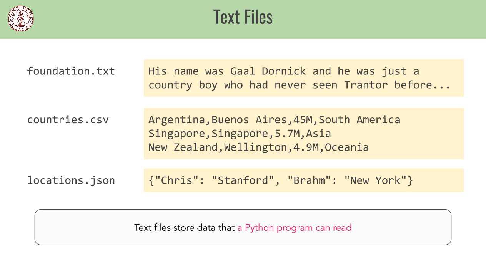
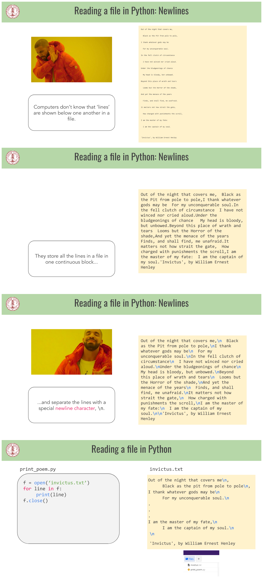
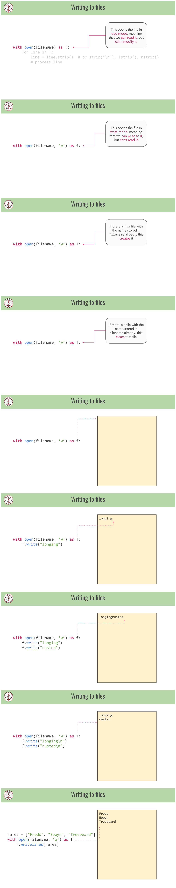
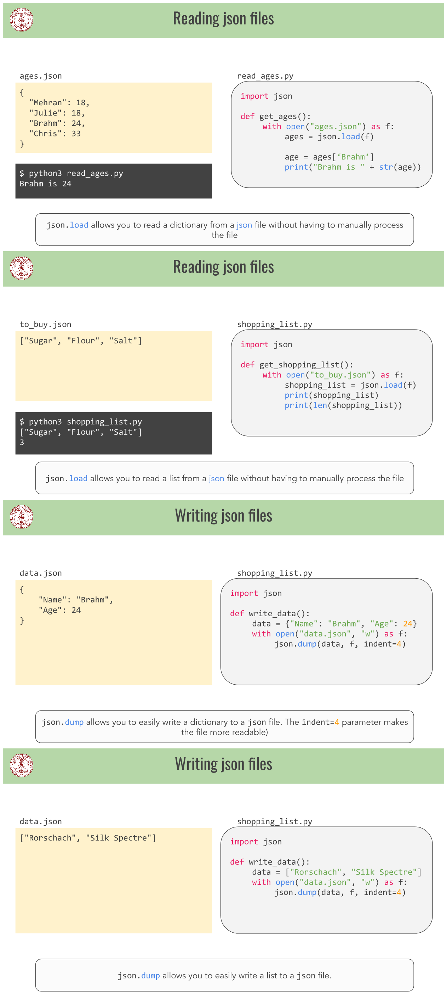

# Python File Reading

Chances are if you've used a computer before, you've interacted with files. Files are a powerful way to store data, and in this class you will learn how to use files in Python to analyze data!

## A brief review of dictionaries

Dictionaries allow us to build one-way associations between one kind of data (which we call the key ) and another (which we call the value). A common metaphor for them is a phone book, whose keys are people’s names and whose values are their phone numbers. It’s super easy to look someone’s number up if you know their name, but harder to do it the other way around.

```python
>>> d = {}             # make an empty dictionary
>>> d['brahm'] = 42    # associate the key ‘brahm’ with the value 42
>>> d['julie'] = 5     # associate the key ‘julie’ with the value 5
>>> d['julie'] = 8     # change the value for ‘julie’ to be 8
                       # since keys need to be unique

>>> d['brahm']         # get the value associated with ‘brahm’ 
42
>>> 'python' in d      # check whether a particular key is in the map
False
```

## What is a file?

The following pictures represent how files on your computer look like on Mac, Windows, and Ed:



When you edit a word document, the program Microsoft Word is opening the file essay.docx. When you watch a video on your computer, the program VLC is opening the file Avengers: Endgame.mp4. When you listen to a song, the program iTunes is opening the file Thriller.mp3.

You've also used files before, in Python. For example, when you write the line of code `img = SimpleImage("buddy.jpg")` , you are opening a file titled buddy.jpg. When you type `python3 program.py` into your terminal, the program python3 is opening the file program.py

Files are used to store text, python programs, audio, video, and more. In your computer, all files are stores as a series of 0s and 1s.



In this class, we will focus on text files, which store data that you can read. There are a few types of text files. A .txt file stores text. A .csv file (short for Comma Separated Values), stores text separated by commas, which can be structured into a table. A .json file stores data that is structured like a dictionary or list.



## Reading a file in Python

### print_poem.py

```python
f = open('invictus.txt')
for line in f:
    # process the line
f.close()
```

### invictus.txt

 Out of the night that covers me,
      Black as the pit from pole to pole,
I thank whatever gods may be
      For my unconquerable soul.
.
.
.
I am the master of my fate,
      I am the captain of my soul.

'Invictus', by William Ernest Henley

### Reading a file in Python: Newlines

Computers don’t know that lines are shown below one another in a file. They store all the lines in a file in one continuous block and separate the lines with a special newline character, `\n`.



## The file-reading loop

This is the canonical loop used to read a file. `.strip()` removes whitespace from each line.

```python
with open(filename) as f:
    for line in f:
        line = line.strip()  # or strip("\n"), lstrip(), rstrip() 
        # process line
```

To skip a line in the file, you can use the function `next(filename)`. Here is the code to skip the first line of a poem:

```python
f = open('invictus.txt')
next(f)
for line in f:
    # process the line
f.close()
```

## `.read()` and `.readlines()`

`.read()` and `.readlines()` are two other ways to read files. `.read()` reads the entire file into a string, and `.readlines()` reads the each line of the file, ending with a `\n`, into a list.

```python
with open(filename) as f:
   lines = f.read() # This reads the entire contents of the files into a string, including the \n newline characters
```

```python
with open(filename) as f:
   lines = f.readlines() # This reads each line of a file (ending with a \n character) into a list
```

A gentle warning: `f.read()` and `f.readlines()` are handy, but shouldn’t be your first resort. If you try to read really big files, that takes up a lot of your computer’s memory, which you should try to avoid. You generally won’t need the contents of the entire file as a string or list, anyway.

## Writing to Files



Visualizing Data

With everything you've learned in this course, you can now put it all together to write a program that visualizes data! [In this example here, watch Brahm write a program that visualizes the population of cities in different countries.](https://www.youtube.com/watch?v=Fj-qt6neUog)

To do so, Brahm makes use of .csv files

Looping through a `csv.reader` splits by commas for you

### plot_countries.py

```python
import csv

def plot_country():
    with open("USA.csv") as f:
        next(f)
        reader = csv.reader(f)

        for line in reader:
            lat = float(line[1])
            lon = float(line[2])
```

### USA.csv

```csv
City,Latitude,Longitude,Population
New York,40.6943,-73.9249,18713220
Los Angeles,34.1139,-118.4068,12750807
Chicago,41.8373,-87.6862,8604203
Miami,25.7839,-80.2102,6445545
Dallas,32.7936,-96.7662,5743938
Philadelphia,40.0077,-75.1339,5649300
Houston,29.7863,-95.3889,5464251
.
.
.
```

Looping through a csv.DictReader and gives you back each line as a dictionary whose keys are column names and whose values are that column’s value for that particular row.

### plot_countries.py

```python
import csv

def plot_country():
    with open("USA.csv") as f:
        reader = csv.DictReader(f)

        for line in reader:
            lat = float(line[‘Latitude’])
            lon = float(line[‘Longitude’])
```

A `csv.writer` allows you to write rows as lists of data, without worrying about things like `\n`  characters.

### plot_countries.py

```python
import csv

def write_data():
    with open("data.csv", "w") as f:
        writer = csv.writer(f)
        writer.writerow(["x", "y"])
        writer.writerows([
            [1,2],
            [2,4],
            [4,6]
        ])
```

### data.csv

```csv
x,y
1,2
2,4
4,6
```

A `csv.DictWriter` allows you to write rows as dictionaries of data, without worrying about things like `\n` characters.

### plot_countries.py

```python
import csv

def write_data():
    with open("data.csv", "w") as f:
        columns = [‘x’, ‘y’]
        writer = csv.DictWriter(f)
        writer.writeheader(fieldnames=columns)
        writer.writerow({‘x’: 1, ‘y’: 2})
        writer.writerow({‘x’: 2, ‘y’: 4})
        writer.writerow({‘x’: 4, ‘y’: 6})
```

### data.csv

```csv
x,y
1,2
2,4
4,6
```

## JSON Files


