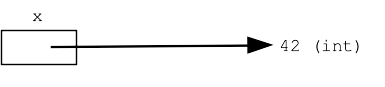
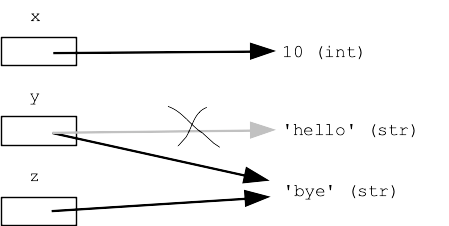
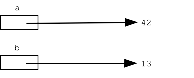
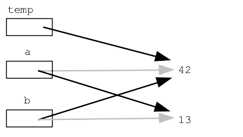

# Variables

A Python variable represents a little bit of memory, keeping track of a value as the code runs.

A variable is created simply with an "assignment" equal sign = stores a pointer to that value into the variable like this:

```python
x = 42
```



Later in the code, appearances of that variable name, e.g. x, retrieve its current value, in this case 42.

Trying to retrieve the value of a variable that does not exist fails with an error (i.e. no = ever assigned that variable).

## Variable Assignment Rules

Here is a more complicated code example and a picture of memory for it, with the variables on the left and their values on the right.

```python
x = 10
y = 'hello'
y = 'bye'
z = y
```



Things to notice here...

1. Assignment like `x = 10` above sets a pointer into that variable, pointing to the value.

2. Assignment like `y = 'bye'` above, where the variable has an existing pointer in it, overwrites the existing pointer with the new one. Put another way, a variable holds just one pointer. Assigning a new pointer gets rid of the old one.

3. Assignment between two variables like `z = y` above, makes them point to the same thing. It does not set up a permanent link between the variables; it is simpler than that. This assignment just changes `z` to point to the `y` value at that moment.

4. Small observation 1: each value in Python is tagged with its type, so in the example above the number 10 is tagged with the type "int", and the string `'hello'` is tagged with its type "str".

Garbage Collection Aside: in the above example, the string 'hello' exists in memory at one time, but then the variable `y` is moved to point to something else. When a value such as a 'hello' here is left with no variable pointing to it, it cannot be used any more by the code. Such memory, storing a value that is not used, is called "garbage", and the "garbage collector" facility reclaims that memory, re-using it to hold new values. This is something Python does automatically behind the scenes. Most modern languages have a garbage collection to reclaim memory automatically.

## Variable Swap

Suppose we have two variables and we want to "swap" their values, so each takes on the value of the other. This is a little coding move that all programmers should know.

```python
a = 42
b = 13
```



It might seem that one can begin with `a = b`, but this does not work, since it overwrites and thus loses the original value of `a`. The classic 3-line solution uses a temporary variable named "temp" to hold this value during the swap, like this:

```python
temp = a
a = b
b = temp
```

Starting with the above diagram, you can trace through the three assignments, leading to this memory structure:



## Assignment `=` is Shallow

The swap example demonstrates a key feature of Python assignment — each assignment `=` merely changes what a variable points to. The int, string etc. values are undisturbed. The assignment `=` in Python just moves an arrow around. In the diagram, this changes the arrows on the left, but the values on the right are undisturbed.

We'll revisit this shallow quality of assignment with parameters and nested data structures.
Variable Names are Superficial Labels

Normally variables names are chosen to reflect what data they contain. That said, there is one funny feature of variable names to know.

Consider the following computation

```python
>>> x = 6
>>> y = x + x
>>> y
12
```

Using a couple variables, it computes that doubling 6 makes 12. Suppose instead it was written this way:

```python
>>> alice = 6
>>> bob = alice + alice
>>> bob
12
```

This is exactly the same computation, just using different variable names. What matters in a computation is the structure — which value is used at each spot in the computation. The variable names are just labels on the computation. If we change a variable name consistently throughout the code, the computation will work the same.

That said, though variable names are superficial, good code uses meaningful variable names, reflecting the role of that data in the algorithm.
