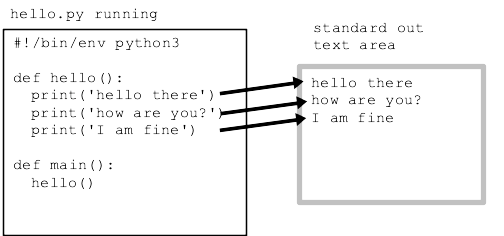

# `print()` and Standard Out

Every running program has a text output area called "standard out", or sometimes just "stdout". The Python print() function takes in python data such as ints and strings, and prints those values to standard out.



To say that standard out is "text" here means a series of lines, where each line is a series of chars with a '\n' newline char marking the end of each line. Standard out is relatively simple. It is a single area of text shared by all the code in a program. Each printed line is appended at its end.

## Standard Out in the Terminal

When you run a program from the terminal, standard out appears right there. Here is example of running the above `hello.py` in the terminal, and whatever it prints appears immediately in the terminal.

```bash
>>> python hello.py
hello there
how are you?
I am fine
```

When using print , you can either use double quotes ("text"), or single quotes ('text')

If your text contains single quotes, you should use double quotes:

 `print("no, you didn't") -->`  **no, you didn't**

If your text contains double quotes, you should use single quotes:

 `print('say "hi" Karel') -->`  **say "hi" Karel**
